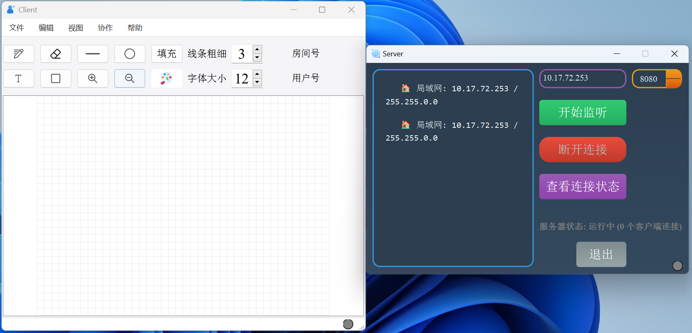
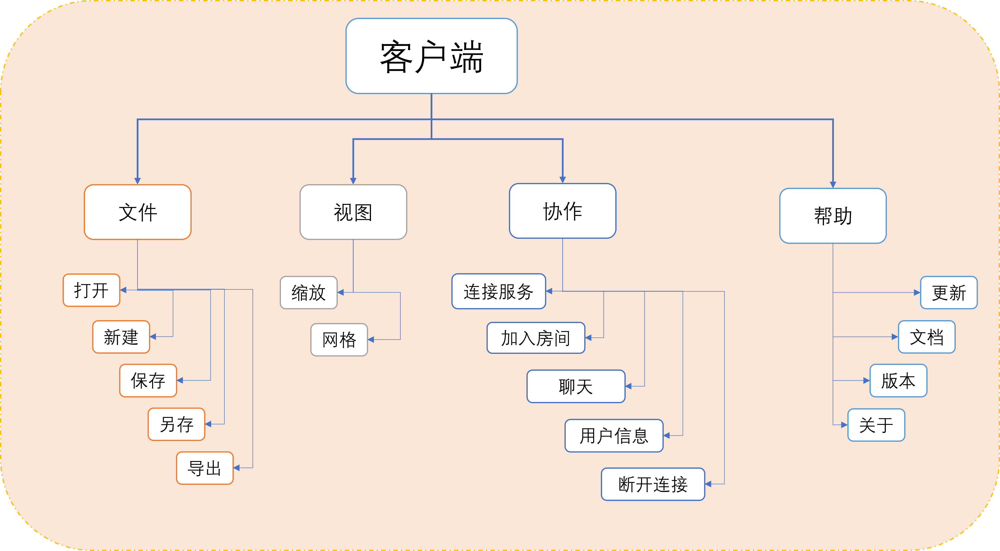
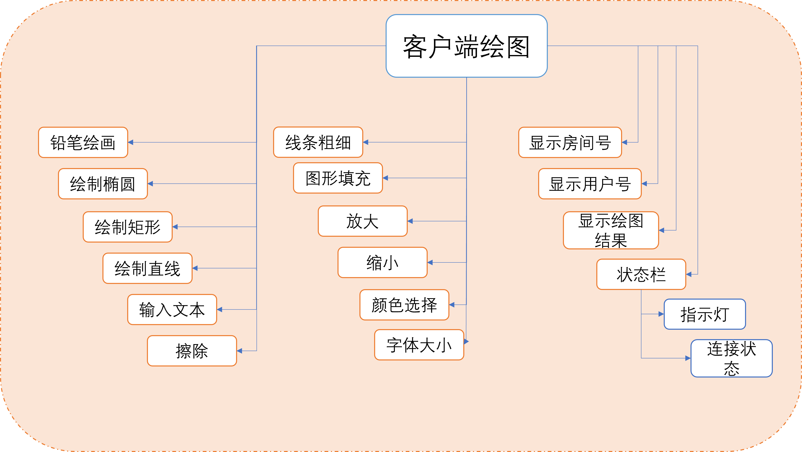
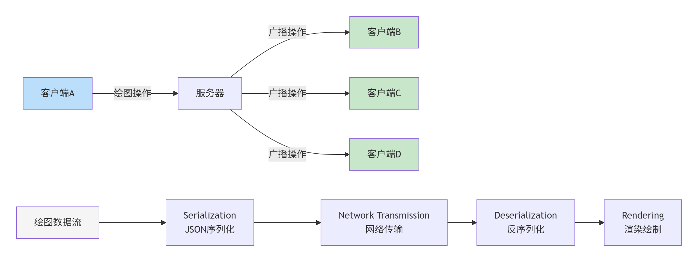
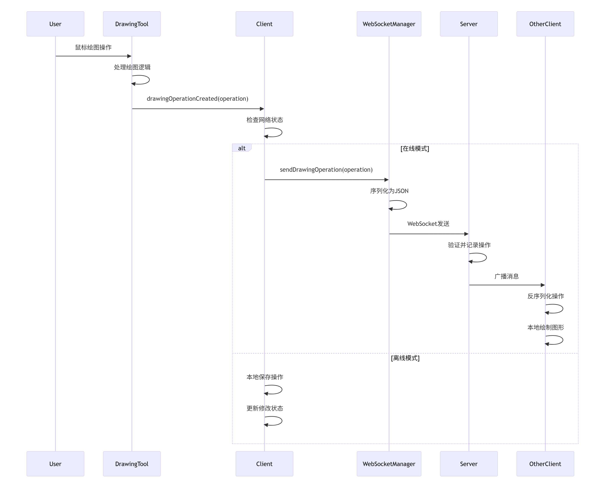
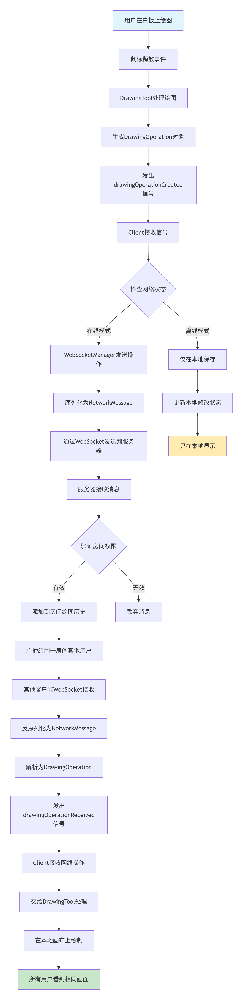

在线白板协作项目
=============================
在线协作白板系统，支持多人实时绘图、文本编辑和聊天通信。系统采用C++/Qt开发，具有铅笔、直线、矩形、椭圆、文本和橡皮擦等多种绘图工具，支持撤销/重做、保存导出等操作。网络模块基于WebSocket实现，支持房间创建、用户管理、实时同步和状态广播。界面设计简洁直观，包含工具栏、颜色选择器和网格背景，提供连接状态指示灯和用户列表显示。该系统实现了较好的协作绘图工作流，包括操作同步、冲突处理和状态管理，适合远程教学、团队会议和协同设计场景使用。

客户端和服务端页面
=============================

项目演示
============================
新建文件，保存文件
----------------------------

打开文件和另存文件
----------------------------

导出文件
----------------------------

多人登录并进入同一房间
----------------------------

多人在线协作绘图
----------------------------

加入房间和在线聊天
----------------------------

注：演示了部分功能，其他功能大家可以自行去尝试

具体功能
==============================
- [√] 多用户实时协作绘图​​：支持多个用户在同一画布上进行实时绘制，所有操作实时同步。
- [√] ​WebSocket 双向通信​​：基于 Qt WebSocket 模块实现稳定、全双工的客户端与服务器通信。
- [√] ​房间系统​​：用户可通过房间ID创建或加入特定房间，实现不同小组间的绘图隔离。
- [√] ​绘图操作同步​​：笔迹、形状等所有绘图操作通过网络实时广播给同一房间内的所有用户。
- [√] ​绘图历史记录与同步​​：服务器保存每个房间的完整绘图操作历史，新用户加入后自动同步全部画面。
- [√] ​用户连接管理​​：服务器维护所有客户端连接状态，分配唯一用户ID，处理连接与断开事件。
- [√] ​实时聊天功能​​：用户可以在房间内发送文本消息，进行实时交流。
- [×] ​基本权限角色​​：初步实现用户角色（如编辑者、演示者），为权限控制奠定基础。
- [√] ​图形化服务器监控​：提供服务器GUI界面，显示日志、连接状态、IP地址和端口配置。
- [√] ​连接状态指示灯​​：使用自定义 LED 指示灯组件，直观显示服务器运行及客户端连接状态。
- [√] ​本地设置持久化​​：使用 QSettings 自动保存和加载服务器地址、端口等用户设置。
- [√] ​网络心跳机制​​：实现心跳包定时发送与检测，用于保持连接活跃和检测客户端状态.
- [√] ​​撤销与重做操作​​：支持基本的撤销和重做命令，并在房间内广播同步。
- [√] ​清屏功能​​：支持一键清除整个画布，操作会同步给房间内所有用户。
- [√] ​IP地址自动检测​​：自动获取并显示本机可用的局域网IPv4地址，方便用户连接。
- [√] 查看用户列表：点击菜单栏“查看用户信息”即可查看当前在线用户信息
- [√] 文件菜单栏：新建文件，打开文件，保存文件，另存文件，导出文件图片，退出程序
- [√] 编辑菜单栏：撤销，重做以及清除功能
- [√] 视图菜单栏：缩放，网格显示功能
- [√] 协作菜单栏：连接服务器，加入房间（存已在），聊天，用户信息，断开连接功能
- [√] 帮助菜单栏：关于该软件信息，版本信息，文档信息以及更新信息功能
- [√] 客户端和服务端都可以查看连接状态信息
- [√] 服务端可以查看当前在线客户端数量，动态的监听客户端的连接状态（定时器）

操作流程
===========================
* 启动客户端和服务端程序（软件）
* 启动服务端的监听状态，服务端聊天框输出监听状态信息，同时服务端指示灯处于“黄颜色的闪烁”状态，表示当前正在监听
* 其中一个客户端可以进入菜单栏“协作” → “连接服务器” → 弹出页面输入IP（默认为本地IP），端口Port，房间号（如果存在就可以加入，不存在房间号就不要输入），用户ID（随机生成），最后点击OK
* 如果成功连接服务器的话，继续弹出一个页面创建房间，随便输入一个房间名即可，创建完成之后
* 第一个客户端和服务端连接成功，从右上角可以看到创建的房间号（第一次是随机生成的）和用户名称
* 由于第一个客户端已经连接并创建房间成功，这个时候已经存在一个房间号了，后面的客户端在连接服务器的时候，就可以输入这个已存在的房间号，这样就可以进入同一个房间，在线协作操作白板了。
* 如果当前客户端要加入其他房间，也可以进入菜单栏“协作” → “加入房间”
* 后面的大家就可以协作的操作白板或者在线看别人的操作过程，包括矩形，椭圆，直线，文本输入，铅笔，颜色变换，线条粗细，字体大小等，更加复杂的图形变换希望大家后面可以继续加入，使用一个列表来保存增加的图形。

模块实现功能
===============================
客户端菜单栏功能
------------------------------

客户端离线绘图功能

客户端和服务端以及其他同一房间的客户端交互流程
-------------------------------

客户端和服务端以及其他同一房间的客户端具体组件之间交互流程
-------------------------------

打包QT程序为exe文件
===============================
[打包工具下载链接](https://enigmaprotector.com/en/downloads.html)

[打包工具安装教程](https://blog.csdn.net/qq_39172792/article/details/145546784?ops_request_misc=&request_id=&biz_id=102&utm_term=enigma%E6%89%93%E5%8C%85%E5%B7%A5%E5%85%B7%E4%B8%8B%E8%BD%BD&utm_medium=distribute.pc_search_result.none-task-blog-2~all~sobaiduweb~default-0-145546784.142^v102^pc_search_result_base4&spm=1018.2226.3001.4187)

[打包工具使用教程](https://blog.csdn.net/qq_35246754/article/details/130831140)

参考链接（推荐）
===============================
漂亮的图标网站
-------------------------------
https://unicode.org/emoji/charts/full-emoji-list.html

https://getemoji.com/

https://emojipedia.org/emoji-mashup/twitter/twemoji-14.0?a=%F0%9F%98%80&b=%F0%9F%98%86

https://www.iconfinder.com/

https://www.flaticon.com/

知识点
-------------------------------
[基于QT 6.6.0 WebSocket协议进行客户端和服务端的通信（C/C++）](https://mydreamambitious.blog.csdn.net/article/details/151568114?spm=1011.2415.3001.5331)

[基于QT 6.6.0 WebSocket协议实现远程桌面协助项目（客户端远程控制服务端，远程桌面显示，鼠标控制以及键盘输入控制）](https://mydreamambitious.blog.csdn.net/article/details/151754484?spm=1011.2415.3001.5331)
https://baike.baidu.com/item/WebSocket/1953845

https://doc.qt.io/qt-6/qwebsocketserver.html

https://blog.csdn.net/gitblog_06785/article/details/147667884

[websocket文档对应的中文翻译](https://blog.csdn.net/Mr_Sunqq/article/details/126904377)

https://subingwen.cn/project/websocket/#2-2-4-%E5%85%B3%E9%97%AD%E8%BF%9E%E6%8E%A5

[RFC6455文档](https://www.rfc-editor.org/search/rfc_search_detail.php)
https://websocket.xiniushu.com/data-framing

QT应用案例汇总
=====================
https://mydreamambitious.blog.csdn.net/article/details/142690011?spm=1011.2415.3001.5331